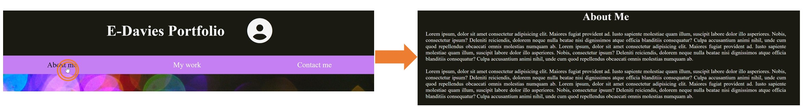

# E-Davies Portfolio

## Description

I wanted to create a portfolio webpage to showcase my work and skills to employer who are looking to hire.

This has been achieved by:
* Creating a functional and responsive webpage
* Providing a navigation bar which, once clicked, takes the user directly to the section: About me, My work and Contact me:

 

* Using CSS grid to showcase my projects which, when clicked on, take the user to the deployed project

* Having a ‘return to top’ arrow button at the bottom of the webpage for easy navigation 

 

* Creating a footer with clickable links to LinkedIn, GitHub and Instagram which will take the user to the individual accounts (currently the LinkedIn and Instagram accounts only take the user to those websites rather than the person accounts)

 

## Installation

Please use the following link to access the website: https://e-davies.github.io/e-davies-portfolio/

## Usage

This website will be used by employers looking to hire and allow them to discover my ability and skills as a front-end developer.
